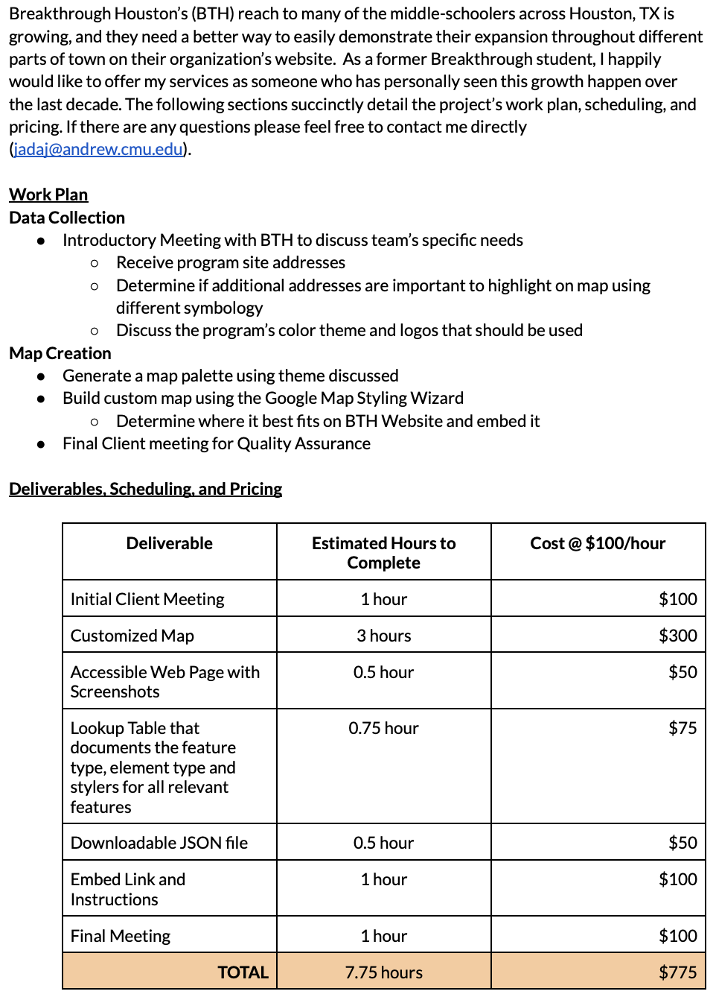
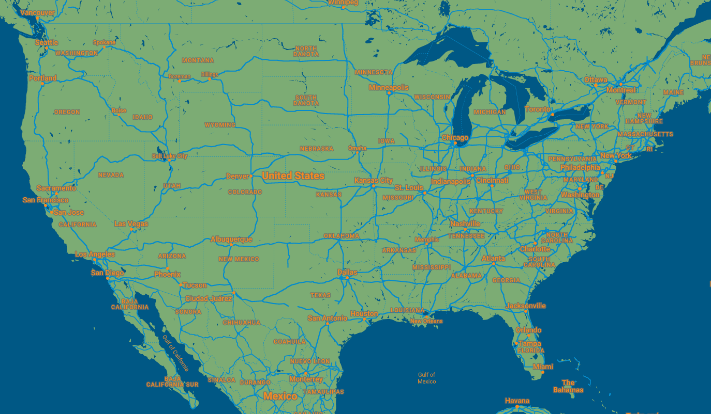
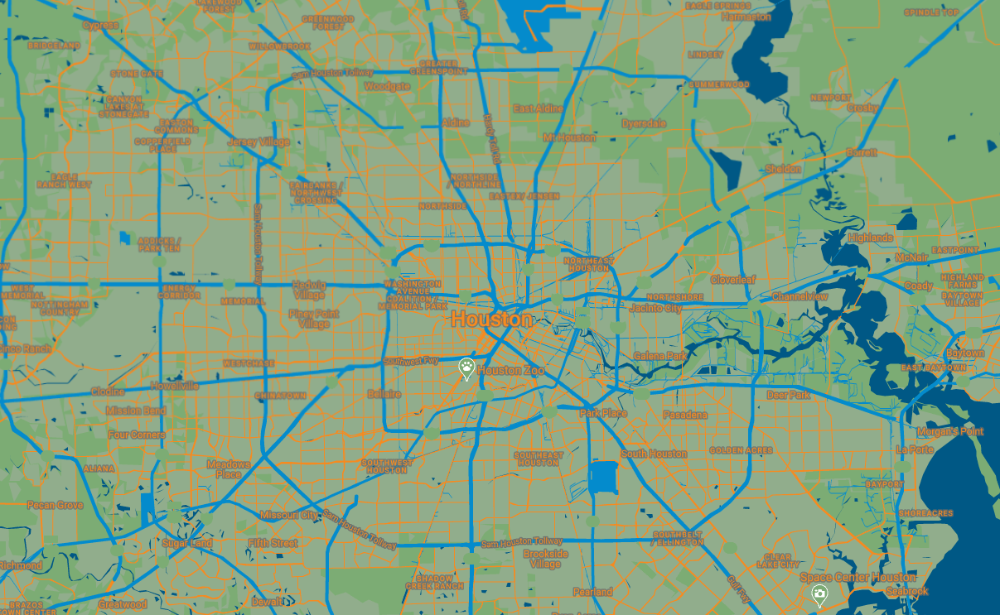
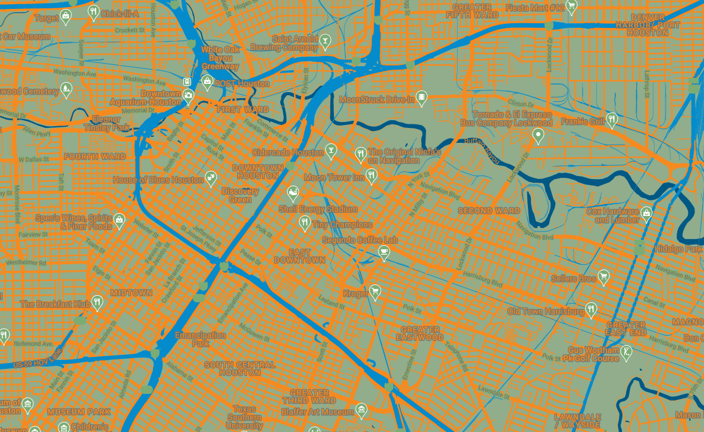
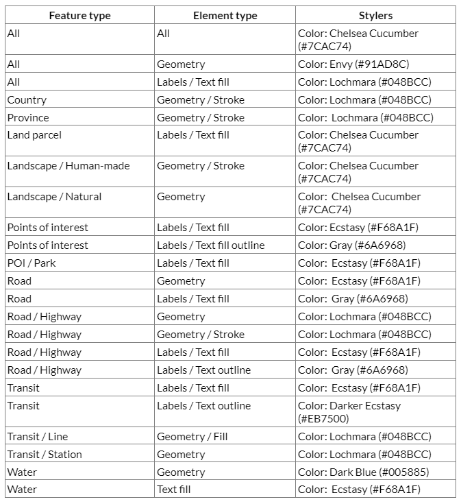

# Response to Breakthrough Houston RFP

Breakthrough Houston (BTH) is an educational program with the aim of placing motivated students from underserved backgrounds on a path to college, and they have sites throughout the Greater Houston Metropolitan area that allow them to facilitate programming in different areas in town. While some people are familiar with the program, they may not necessarily know which site is closest to them. BTH has put out an RFP to get their mapping needs met. Below are the steps I took to bid for and fulfill their needs.

## The Bid

## The Customized Map Style and Its Components

### The Map Style Breakdown

Using Breakthrough Houston's logo, I gathered a color palette using Canva's Color Paletter Generator. In the following image, you'll see which hex codes were the output for BTH.

Using Google Styling Wizard, I using the hex codes gathered from their logo and build out their customizable map. The JSON Code Sample is linked here:

[Breakthrough Houston Customized Map Style](BTHmap.json)

### The Map Style

Here is a further zoomed out view of the map, which allows you to see how the color palette plays out a larger scale.

Here is a further zoomed in view of the map, which allows you to see how the color palette plays out a smaller scale.

Here is a close up view of the map, which allows you to see how the color palette plays out nearly at street level.

#### The Lookup Table

### Design Choice Overview
While the blue (Loc and orange from the 
