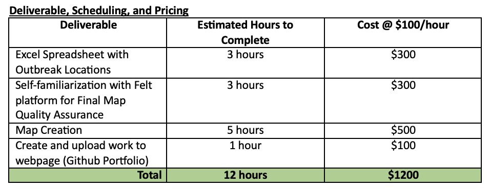
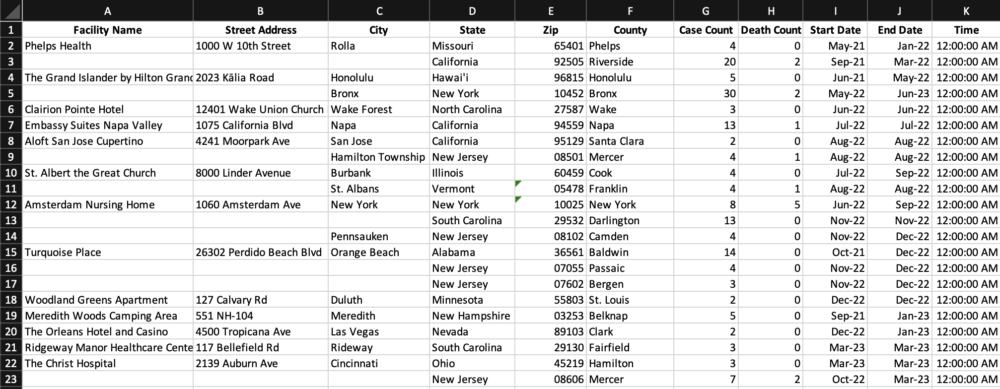

# Legionnaire's Disease Outbreaks in the US from 2021 to 2023

## Response to IDEXX Laboratories’ Tracking Legionnaire’s Disease RFP

On the quest to get one of their newest tests kits, Legiolert, out on the market, IDEXX Water has sent out an RFP for a GIS Analyst to map Legionnaire’s Disease (LD) outbreaks throughout the US over the last two years, and going forward, IDEXX wants for someone on their team to be able to update this map as news comes out. Overall, the map would help the Regulatory Affairs and Marketing teams to better collaborate on identifying which areas of the country could best benefit from using Legiolert in their premise water systems. 

***Why should confronting Legionnaire’s Disease be a priority?***

In the wake of the global Covid-19 pandemic, the country has seen how socioeconomic barriers intersected and fueled higher deathrates for Black Americans across every age category (Brookings, 2021). While the general messaging throughout this pandemic has been that the elderly and immunocompromised are the most vulnerable, the idea of “vulnerability” must be malleable when considering social and environmental factors. More importantly, recognizing that this notion of vulnerability expands far beyond Covid-19 is a practical approach to looking at how other factors disproportionately affect BIPOC communities and their health outcomes.

“Race operates on many levels to influence the potential for exposure to environmental hazards and diseases” (National Institutes of Health, 2002). Therefore, acknowledging that someone’s environment is a risk factor in potential exposure to disease is essential when looking at the rise in another respiratory illness that is majorly affecting the Black American community due to environmental injustice – Legionnaire’s Disease. As of 2018, Legionnaires’ disease cases have been occurring almost twice as high among Black Americans compared with their white counterparts, so looking at the environments in which they operate daily is a crucial place to start.

“Neighborhood and built environment factors that may affect Legionnaires’ disease health disparities include housing, drinking water infrastructure, and pollutant exposures” (Hunter et al, 2021). Because of prejudice housing policies stemming from the twentieth century, more than 80% of large metropolitan neighborhoods around the US have remained segregated (Semuels, 2021), by way of de-facto segregation (Rothstein, 2017). “Housing and neighborhood
variables include housing vacancies, property ownership status, housing age, housing quality, and pollutant exposures,” and when comparatively observed, these variables tend to be systemically worse in Black neighborhoods.

It is safe to assume that with LD infections occurring drastically more often for Black Americans whose homes are overwhelmingly older and systemically overlooked, their unhealthy built environment is enough reason to consider LD an environmental justice issue. The lack of proper maintenance of water distribution systems that provide hundreds of thousands of BIPOC community members with such a vital resource should not be a threat, rather a safe system that community members can rely on irrespective of race or socioeconomic status.

***How IDEXX Can Help***

Identifying where their product is needed the most will be key for not only the improvement in quality of life for many people across the country but also the company’s profit.

## GIS Project Summary

Create a map that identifies Legionnaire’s Disease hotspots over the last two years.
	- This will serve as a baseline. 
        - To better substantiate how LD is an environmental justice issue, include census tract racial demographic data as a feature layer, to show which groups are likely experiencing outbreaks more often.
Create a spreadsheet with outbreak locations that the team can constantly update and geocode into the map.
	- Teach team members how to update map (if time allows it)

### Workplan
**Data Collection**
- Review initial data collected in Summer of 2022
	- Update data through April 2022
- Compile information into spreadsheet.

**Map Creation**
- Use data to create a Felt Map, especially given that ArcGIS Pro is not a resource in that the Regulatory Affairs team can fit into their budget. 
	- Spend some time familiarizing myself with the platform.
	- Input data and see how to best visualize different elements of the problem.

## Felt Map

<iframe width="100%" height="600" frameborder="0" title="Felt Map" src="https://felt.com/embed/map/Untitled-Map-UyC0Ex9B5RBuX5fPZz0BV1A?lat=32.054385&lon=-94.123685&zoom=3.59"></iframe>

Felt was a great alternative to use, and in realizing how intuitive the platform is, I do think that the IDEXX Regulatory Affairs team could find such a map incredibly useful. It was incredibly easy to add a US Counties layer, and customizing the map to make it as simple as possible was also quite the easy feat. The most difficult, or time-consuming, task of this project actually happened in the data collection phase given the lack of centraliziation on Legionnaire's Disease outbreaks. I spent significantly more time on this than I had anticipated, which you can see below.

The initial "RFP" stated that I would spend three hours ($300) on data collection, when in truth, I spent nearly 11 hours on that portion alone. The map creation on Felt and ArcGIS took less time than that portion alone. When you check my process log, you can see that I actually spend almost 11 hours on data collection alone, and the map and Github write-up portion was the final bit of work at about seven additional hours. In total, if I had stuck to this pricing outline, I would have been significantly underpaid, and much of the mapping work, which was the deliverable, would have happened beyond what I had initially billed IDEXX.

The excel with the data can be seen here: 

## [ArcGIS Map with Hot Spot Analysis](https://carnegiemellon.maps.arcgis.com/home/item.html?id=20bff5ab194c447abd19a360baf1e490)
In realizing that some of the more advanced tools needed to analyze the data were not available on Felt just yet, I still wanted to upload the data into ArcGIS to use the Hot Spot Analysis tool. Given the widespread occurance of the disease, each outbreak showed as a "hot spot," which was to be expected, but the areas in between did not even fall into confidence intervals to be considered "cold spots."
